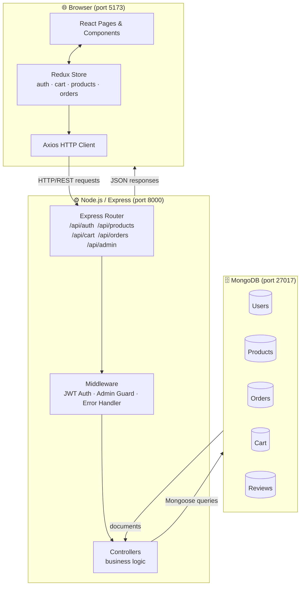
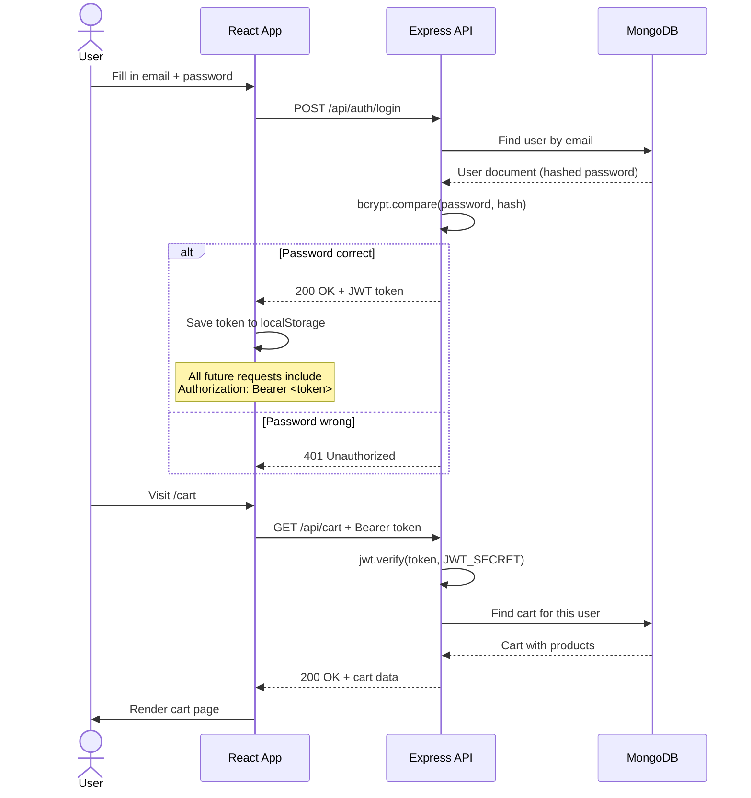
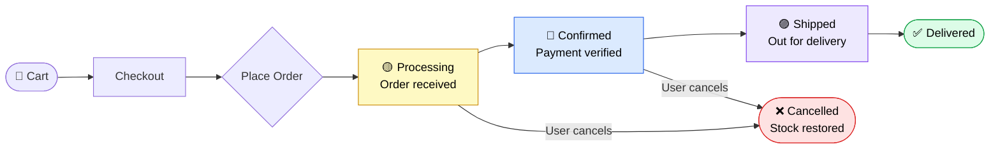
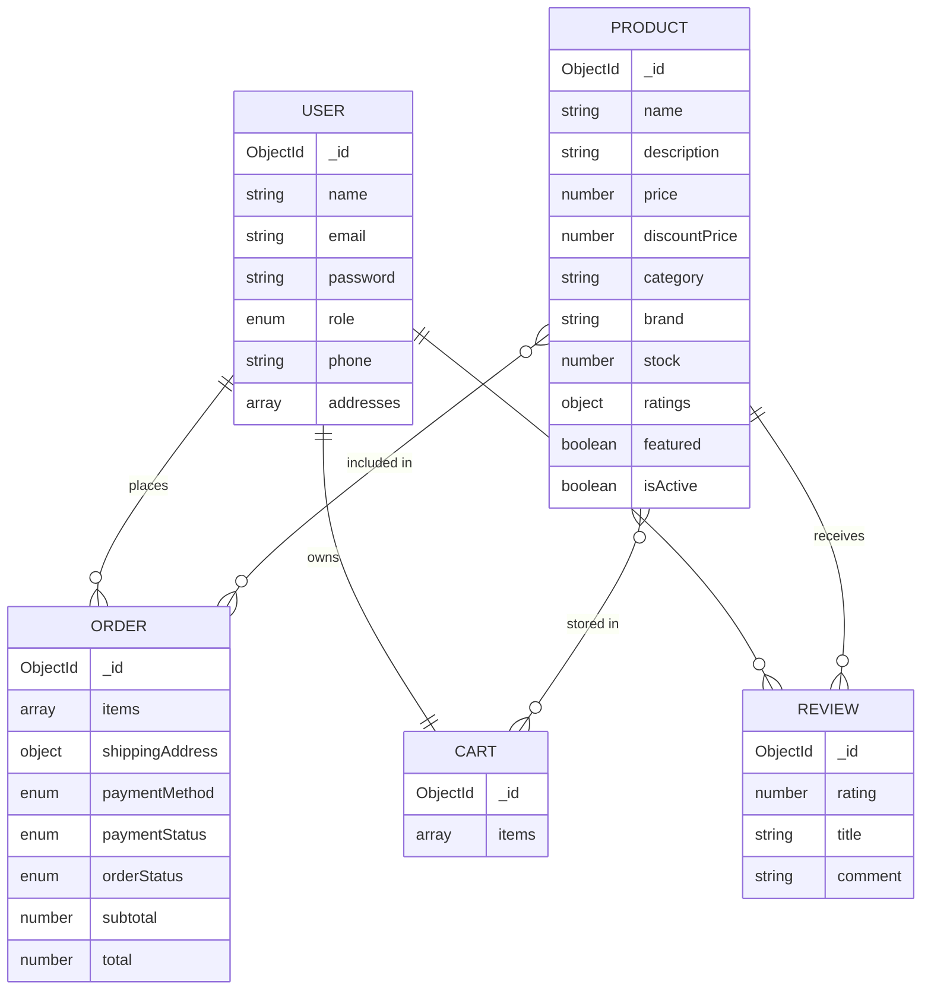
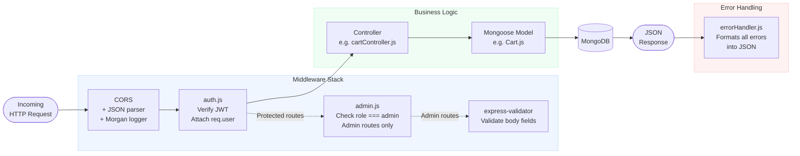

<div align="center">

# 🛒 ShopKart

### A full-stack eCommerce platform built with the MERN stack

*Browse products · Manage a cart · Place orders · Admin panel — all running locally*

<br/>

[](https://nodejs.org)
[](https://reactjs.org)
[](https://mongodb.com)
[](https://expressjs.com)
[](https://tailwindcss.com)
[](https://redux-toolkit.js.org)
[](LICENSE)
[](CONTRIBUTING.md)

<br/>

[Getting Started](#-getting-started) · [Architecture](#-how-it-works) · [API Docs](#-api-reference) · [Troubleshooting](#-troubleshooting) · [Contributing](#-contributing)

</div>

---

## 📖 Table of Contents

- [What is ShopKart?](#-what-is-shopkart)
- [Features](#-features)
- [Tech Stack](#-tech-stack)
- [How It Works](#-how-it-works)
  - [System Architecture](#system-architecture)
  - [Authentication Flow](#authentication-flow)
  - [Order Lifecycle](#order-lifecycle)
  - [Database Schema](#database-schema)
  - [Backend Request Pipeline](#backend-request-pipeline)
- [Project Structure](#-project-structure)
- [Getting Started](#-getting-started)
  - [Prerequisites](#prerequisites)
  - [Installation](#installation)
- [Environment Variables](#-environment-variables)
- [Running the Project](#-running-the-project)
- [Seed Data](#-seed-data)
- [Screenshots](#-screenshots)
- [API Reference](#-api-reference)
- [Troubleshooting](#-troubleshooting)
- [Docker](#-docker)
- [Future Improvements](#-future-improvements)
- [Contributing](#-contributing)
- [License](#-license)

---

## 💡 What is ShopKart?

ShopKart is a **Flipkart-inspired eCommerce web application** that you can clone and run entirely on your own computer — no paid hosting or cloud accounts needed.

It covers the entire shopping experience end to end:

| Who | What they can do |
|---|---|
| **Visitors** | Browse and search products, view product details and reviews |
| **Registered Users** | Add to cart, checkout, track orders, write reviews |
| **Admins** | Manage products, monitor orders, view revenue stats |

> **New to MERN Stack?** MERN stands for **M**ongoDB + **E**xpress + **R**eact + **N**ode.js — the four technologies this project is built with. Each handles a different part of the app. You'll see how they fit together in the [How It Works](#-how-it-works) section below.

---

## ✨ Features

<details open>
<summary><strong>👤 User Features</strong></summary>

- Register and login with JWT-based authentication
- Browse, search, and filter products by category, price range, and star rating
- View product pages with image gallery, specifications table, and customer reviews
- Write and submit reviews (one per product per user)
- Add to cart with quantity controls — cart is saved on the server, so it persists across devices
- Checkout with a delivery address form and mock payment (COD, UPI, Card — no real money involved)
- View full order history with a visual step-by-step status tracker
- Cancel an order before it is shipped

</details>

<details open>
<summary><strong>🔧 Admin Features</strong></summary>

- Dedicated `/admin` panel — invisible and inaccessible to regular users
- Dashboard showing total revenue, order count, product count, and user count
- Full product management: create, edit, and soft-delete products
- Inline order status updates (Processing → Confirmed → Shipped → Delivered)
- User list with registration dates

</details>

---

## 🛠 Tech Stack

| Layer | Technology | Why it's used |
|---|---|---|
| **Frontend UI** | [React 18](https://react.dev) + [Vite](https://vitejs.dev) | Fast component-based UI with instant hot reload |
| **Styling** | [Tailwind CSS 3](https://tailwindcss.com) | Utility-first CSS — style directly in JSX |
| **State Management** | [Redux Toolkit](https://redux-toolkit.js.org) | Predictable global state for cart, auth, orders |
| **Routing** | [React Router v6](https://reactrouter.com) | Client-side navigation between pages |
| **HTTP Requests** | [Axios](https://axios-http.com) | Calls the backend API with automatic auth headers |
| **Backend** | [Node.js](https://nodejs.org) + [Express](https://expressjs.com) | REST API server |
| **Database** | [MongoDB](https://mongodb.com) + [Mongoose](https://mongoosejs.com) | Stores all data; Mongoose adds structure with schemas |
| **Auth** | [JWT](https://jwt.io) + [bcryptjs](https://github.com/dcodeIO/bcrypt.js) | Stateless authentication — no sessions needed |
| **Dev Tools** | [Nodemon](https://nodemon.io), [Morgan](https://github.com/expressjs/morgan) | Auto-restart server, request logging |
| **Notifications** | [React Hot Toast](https://react-hot-toast.com) | Toast messages for success/error feedback |

---

## 🔍 How It Works

### System Architecture

This diagram shows how the three parts of the app — browser, server, and database — talk to each other.



> **Beginner tip:** The browser never talks to MongoDB directly. Every request goes through the Express server first, which checks permissions and then reads or writes to the database.

---

### Authentication Flow

This sequence diagram shows what happens when a user logs in, and how subsequent requests are authenticated.



> **What is JWT?** A JWT (JSON Web Token) is a small, encoded string the server gives you after login. Think of it as a temporary ID badge — you attach it to every request so the server knows who you are, without needing to look up a session in the database each time.

---

### Order Lifecycle

Every order moves through these states. Only admins can advance the status; users can only cancel from `processing` or `confirmed`.



> When an order is cancelled, product stock is automatically restored so the items become available again.

---

### Database Schema

This diagram shows the five MongoDB collections and how they relate to each other.



---

### Backend Request Pipeline

Every API request passes through these layers in sequence before hitting the database.



---

## 📁 Project Structure

```
ecomm-web/
│
├── backend/                     ← Express REST API
│   ├── config/
│   │   └── db.js                ← Connects to MongoDB on startup
│   │
│   ├── middleware/
│   │   ├── auth.js              ← Reads JWT from header, attaches user to req
│   │   ├── admin.js             ← Blocks non-admins from /api/admin routes
│   │   └── errorHandler.js      ← Catches all errors, returns clean JSON
│   │
│   ├── models/                  ← Mongoose schemas (the shape of your data)
│   │   ├── User.js
│   │   ├── Product.js
│   │   ├── Order.js
│   │   ├── Cart.js
│   │   └── Review.js
│   │
│   ├── controllers/             ← The actual logic for each feature
│   │   ├── authController.js
│   │   ├── productController.js
│   │   ├── cartController.js
│   │   ├── orderController.js
│   │   └── adminController.js
│   │
│   ├── routes/                  ← Maps URLs to controller functions
│   │   ├── authRoutes.js
│   │   ├── productRoutes.js
│   │   ├── cartRoutes.js
│   │   ├── orderRoutes.js
│   │   └── adminRoutes.js
│   │
│   ├── seed/
│   │   └── seedData.js          ← Run once to fill DB with demo products + users
│   ├── utils/
│   │   └── generateToken.js     ← Creates a JWT for a given user ID
│   ├── .env                     ← Your local env vars (gitignored — never committed)
│   ├── package.json
│   └── server.js                ← Entry point — starts the Express app
│
└── frontend/                    ← React + Vite app
    └── src/
        ├── components/
        │   ├── common/          ← Header, Footer, Loader, ProtectedRoute
        │   ├── product/         ← ProductCard, ProductFilters
        │   ├── cart/            ← CartItem
        │   └── admin/           ← AdminSidebar
        │
        ├── pages/               ← One file per page/screen
        │   ├── HomePage.jsx
        │   ├── LoginPage.jsx
        │   ├── RegisterPage.jsx
        │   ├── ProductsPage.jsx
        │   ├── ProductDetailPage.jsx
        │   ├── CartPage.jsx
        │   ├── CheckoutPage.jsx
        │   ├── OrdersPage.jsx
        │   ├── OrderDetailPage.jsx
        │   └── admin/
        │       ├── AdminDashboard.jsx
        │       ├── AdminProducts.jsx
        │       ├── AdminOrders.jsx
        │       └── AdminAddProduct.jsx
        │
        ├── store/
        │   ├── store.js         ← Combines all slices into one Redux store
        │   └── slices/          ← authSlice, cartSlice, productSlice, orderSlice
        │
        ├── services/
        │   └── api.js           ← Axios instance; auto-attaches JWT to requests
        ├── utils/
        │   └── helpers.js       ← formatPrice, getDiscountPercent, etc.
        ├── App.jsx              ← All route definitions in one place
        └── main.jsx             ← React entry point
```

---

## 🚀 Getting Started

### Prerequisites

You need these tools installed before you can run the project. Click the links to download them.

| Tool | Min. Version | How to check | Download |
|---|---|---|---|
| **Node.js** | v18 | `node -v` | [nodejs.org](https://nodejs.org) |
| **npm** | v9 | `npm -v` | *(comes with Node.js)* |
| **MongoDB** | v6 | `mongod --version` | [mongodb.com](https://www.mongodb.com/try/download/community) |
| **Git** | Any | `git --version` | [git-scm.com](https://git-scm.com) |

> **MongoDB must be running** in the background before you start the backend server. See [how to start MongoDB](#mongodb-connection-refused) for your operating system.

---

### Installation

Follow these steps in order. Each one builds on the previous.

#### Step 1 — Clone the repository

```bash
git clone https://github.com/your-username/ecomm-web.git
cd ecomm-web
```

> **What is `git clone`?** It copies the entire project from GitHub to a folder on your computer.

---

#### Step 2 — Set up the Backend

```bash
cd backend
npm install
```

> `npm install` reads `package.json` and downloads all the libraries the backend needs into a `node_modules/` folder.

**Create your environment file:**

Create a file called `backend/.env` and paste in the following content:

```env
PORT=8000
MONGO_URI=mongodb://127.0.0.1:27017/ecommerce
JWT_SECRET=pick-any-long-random-string-and-put-it-here
JWT_EXPIRES_IN=7d
CLIENT_URL=http://localhost:5173
NODE_ENV=development
```

Replace `pick-any-long-random-string-and-put-it-here` with your own secret. Make it long and random — never share it publicly. If your secret contains special characters like `#` or `%`, wrap it in double quotes: `JWT_SECRET="my#secret"`.

> **What is `JWT_SECRET`?** It's a private password your server uses to sign authentication tokens. This file is gitignored and will never be committed to GitHub.

**Seed the database** (run this only once, or when you want to reset demo data):

```bash
npm run seed
```

You will see this confirmation in the terminal:

```
✅ Seeded 3 users
✅ Seeded 15 products

📧 Admin credentials: admin@ecomm.com / admin123
📧 User credentials:  john@example.com / password123
```

**Start the backend server:**

```bash
npm run dev
```

You should see:

```
🚀 Server running at http://localhost:8000
📦 Environment: development
MongoDB connected: 127.0.0.1
```

> If you see a MongoDB connection error instead, see [Troubleshooting → MongoDB connection refused](#mongodb-connection-refused).

> **macOS users:** Port 5000 is used by AirPlay Receiver on macOS Monterey and later. This project uses port **8000** to avoid that conflict. If you need to change it, update `PORT` in `backend/.env` and `target` in `frontend/vite.config.js`.

---

#### Step 3 — Set up the Frontend

**Open a new terminal window** (keep the backend running in the first one), then:

```bash
cd frontend
npm install
```

**Create the environment file:**

Create a file called `frontend/.env` and paste in the following content:

```env
VITE_API_URL=http://localhost:8000/api
```

> The Vite dev server is also configured to automatically forward any `/api` request to `http://localhost:8000`, so API calls work even without setting this variable.

**Start the frontend:**

```bash
npm run dev
```

You should see:

```
  VITE v5.x.x  ready in xxx ms

  ➜  Local:   http://localhost:5173/
```

**Open your browser and visit: [http://localhost:5173](http://localhost:5173)**

---

## 🔑 Environment Variables

### `backend/.env`

| Variable | Required | Default | Description |
|---|---|---|---|
| `PORT` | No | `8000` | Port the API server listens on |
| `MONGO_URI` | **Yes** | — | Full MongoDB connection string |
| `JWT_SECRET` | **Yes** | — | Secret used to sign and verify tokens. Keep this private. |
| `JWT_EXPIRES_IN` | No | `7d` | Token validity period (`7d` = 7 days, `1h` = 1 hour) |
| `CLIENT_URL` | No | `http://localhost:5173` | The only allowed CORS origin |
| `NODE_ENV` | No | `development` | Set to `production` when deploying |

### `frontend/.env`

| Variable | Required | Default | Description |
|---|---|---|---|
| `VITE_API_URL` | No | `/api` | Base URL prepended to every Axios request |

> **Security reminder:** Never commit either `.env` file to Git. Both are listed in `.gitignore` and will never be pushed to GitHub.

---

## ▶️ Running the Project

You need **two terminal windows** open at the same time — one for the backend, one for the frontend.

```
┌─────────────────────────────────┐  ┌─────────────────────────────────┐
│        Terminal 1 — API         │  │      Terminal 2 — Frontend      │
├─────────────────────────────────┤  ├─────────────────────────────────┤
│  cd backend                     │  │  cd frontend                    │
│  npm run dev                    │  │  npm run dev                    │
│                                 │  │                                 │
│  → http://localhost:8000        │  │  → http://localhost:5173        │
└─────────────────────────────────┘  └─────────────────────────────────┘
```

| Service | URL | Notes |
|---|---|---|
| **App (Frontend)** | http://localhost:5173 | Open this in your browser |
| **API (Backend)** | http://localhost:8000/api | Called automatically by the frontend |
| **Health Check** | http://localhost:8000/api/health | Returns `{"status":"OK"}` if server is up |

### Or run everything with one command (Docker)

If you have Docker installed, skip the two-terminal setup entirely:

```bash
docker compose up --build
```

MongoDB, the backend, and the frontend all start together. See the [Docker](#-docker) section for full details.

---

## 🌱 Seed Data

The seed script fills your database with realistic demo data so you can explore the app immediately.

**Demo accounts:**

| Role | Email | Password | Can do |
|---|---|---|---|
| Admin | `admin@ecomm.com` | `admin123` | Everything + Admin Panel |
| User | `john@example.com` | `password123` | Shop, cart, orders |
| User | `jane@example.com` | `password123` | Shop, cart, orders |

**15 demo products across 5 categories:**

| Category | Products |
|---|---|
| 📱 Electronics | Samsung Galaxy S24 Ultra, Apple iPhone 15 Pro, Sony WH-1000XM5, Dell XPS 15, LG 4K OLED TV |
| 👗 Clothing | Levi's 501 Jeans, Nike Air Force 1, Allen Solly Formal Shirt |
| 🏠 Home & Kitchen | Instant Pot Duo 7-in-1, Dyson V12 Vacuum, Philips Air Fryer |
| ⚽ Sports | Yonex Astrox Badminton Racket, Decathlon Running Shoes |
| 📚 Books | Atomic Habits, The Alchemist, Clean Code |

> **⚠️ Warning:** Running `npm run seed` again will **delete all existing data** (products, users, orders) before re-seeding. Don't run it against a database with real data you want to keep.

---

## 🖼 Screenshots

> *Screenshots will be added after UI polish is complete. To add yours: take a screenshot, save it to `docs/screenshots/`, and replace the placeholder links below.*

| Page | Preview |
|---|---|
| 🏠 Homepage | *(coming soon)* |
| 🔍 Product Listing | *(coming soon)* |
| 📦 Product Detail | *(coming soon)* |
| 🛒 Cart | *(coming soon)* |
| 💳 Checkout | *(coming soon)* |
| 📋 Order History | *(coming soon)* |
| 📊 Admin Dashboard | *(coming soon)* |
| ⚙️ Admin Products | *(coming soon)* |

---

## 📡 API Reference

All endpoints are prefixed with `/api`. Protected routes require an `Authorization: Bearer <token>` header.

<details>
<summary><strong>🔐 Auth — <code>/api/auth</code></strong></summary>

| Method | Endpoint | Auth? | Description |
|---|---|---|---|
| `POST` | `/register` | No | Create a new account. Body: `{ name, email, password, phone }` |
| `POST` | `/login` | No | Login. Returns `{ token, user }`. Body: `{ email, password }` |
| `GET` | `/profile` | Yes | Returns the current user's full profile |
| `PUT` | `/profile` | Yes | Update name, phone, or password |
| `POST` | `/address` | Yes | Add a new delivery address |
| `DELETE` | `/address/:id` | Yes | Remove an address by ID |

</details>

<details>
<summary><strong>📦 Products — <code>/api/products</code></strong></summary>

| Method | Endpoint | Auth? | Description |
|---|---|---|---|
| `GET` | `/` | No | Paginated product list. Query params: `keyword`, `category`, `minPrice`, `maxPrice`, `minRating`, `sort`, `page`, `limit` |
| `GET` | `/categories` | No | Returns array of distinct category names |
| `GET` | `/:id` | No | Single product by MongoDB ID |
| `GET` | `/:id/reviews` | No | All reviews for a product |
| `POST` | `/:id/reviews` | Yes | Submit a review. Body: `{ rating, title, comment }` |

</details>

<details>
<summary><strong>🛒 Cart — <code>/api/cart</code></strong></summary>

All cart routes require authentication.

| Method | Endpoint | Description |
|---|---|---|
| `GET` | `/` | Get the logged-in user's cart (populated with product data) |
| `POST` | `/` | Add item. Body: `{ productId, quantity }` |
| `PUT` | `/:productId` | Update quantity. Body: `{ quantity }` |
| `DELETE` | `/:productId` | Remove one item from cart |
| `DELETE` | `/` | Empty the entire cart |

</details>

<details>
<summary><strong>📋 Orders — <code>/api/orders</code></strong></summary>

All order routes require authentication.

| Method | Endpoint | Description |
|---|---|---|
| `POST` | `/` | Place a new order. Deducts stock + clears cart. Body: `{ items, shippingAddress, paymentMethod }` |
| `GET` | `/` | All orders for the current user |
| `GET` | `/:id` | Single order by ID |
| `PUT` | `/:id/cancel` | Cancel order (only if status is `processing` or `confirmed`) |

</details>

<details>
<summary><strong>🔧 Admin — <code>/api/admin</code> (admin role required)</strong></summary>

| Method | Endpoint | Description |
|---|---|---|
| `GET` | `/dashboard` | Stats: revenue, counts, status breakdown, recent orders |
| `GET` | `/products` | All products with pagination + keyword search |
| `POST` | `/products` | Create a product |
| `PUT` | `/products/:id` | Update any product field |
| `DELETE` | `/products/:id` | Soft-delete (sets `isActive: false`) |
| `GET` | `/orders` | All orders — filter by status with `?status=shipped` |
| `PUT` | `/orders/:id/status` | Update order status. Body: `{ orderStatus, trackingNumber? }` |
| `GET` | `/users` | All registered users |

</details>

---

## 🐛 Troubleshooting

### MongoDB connection refused

**Error:**
```
MongoDB connection error: connect ECONNREFUSED 127.0.0.1:27017
```

**What it means:** Your backend started but can't find MongoDB — because MongoDB isn't running yet.

**Fix:**

```bash
# macOS (if installed with Homebrew)
brew services start mongodb-community

# Linux
sudo systemctl start mongod

# Windows
# Open the Start menu → search "Services" → find "MongoDB" → click Start
```

To verify MongoDB is running: `mongosh` — if a prompt appears, it's working. Type `exit` to close.

---

### `npm run seed` fails with duplicate key error

**What it means:** There is already data in the database from a previous seed run, and the unique index on `email` is rejecting the duplicates.

**Fix:** Drop the database and re-seed:

```bash
mongosh
```
```js
use ecommerce
db.dropDatabase()
exit
```
```bash
cd backend
npm run seed
```

---

### Frontend shows "Network Error" or blank data

**Check 1 — Is the backend running?**
Open a new browser tab and visit: `http://localhost:8000/api/health`
You should see `{"status":"OK"}`. If you get an error, the backend is not running.

**Check 2 — Is the proxy configured?**
Open [frontend/vite.config.js](frontend/vite.config.js) and confirm:
```js
proxy: {
  '/api': { target: 'http://localhost:8000', changeOrigin: true }
}
```

**Check 3 — Is your `.env` correct?**
`frontend/.env` should contain:
```env
VITE_API_URL=http://localhost:8000/api
```

---

### Getting logged out unexpectedly

**What it means:** Your JWT token has expired (default: 7 days) or localStorage got cleared.

**Fix:** Clear the stale token and log in again:
```js
// Paste this into the browser console (F12 → Console tab)
localStorage.clear()
location.reload()
```

---

### `npm install` fails with version errors

**Fix:** Ensure you're on Node.js v18+:
```bash
node -v   # should print v18.x.x or higher
```

Use [nvm](https://github.com/nvm-sh/nvm) (Node Version Manager) to switch versions without uninstalling:
```bash
nvm install 18
nvm use 18
node -v   # now shows v18.x.x
```

---

### Port already in use

**Error:**
```
Error: listen EADDRINUSE: address already in use :::8000
```

**What it means:** Something else is already running on port 8000 (often a previous `npm run dev` that wasn't stopped properly).

**Fix:**

```bash
# macOS / Linux — kill whatever is using port 8000
lsof -ti:8000 | xargs kill

# Windows (PowerShell)
netstat -ano | findstr :8000
# Note the PID in the last column, then:
taskkill /PID <PID> /F
```

> **macOS note:** Port 5000 is reserved by AirPlay Receiver on macOS Monterey+. This project deliberately uses port **8000** to avoid that conflict.

---

### Admin panel is not visible / 403 Forbidden

**What it means:** You're logged in with a regular user account, not an admin account.

**Fix:** Log out and log back in with the admin account:
- Email: `admin@ecomm.com`
- Password: `admin123`

The Admin Panel link only appears in the header dropdown for users with `role: "admin"`.

---

## 🐳 Docker

Run the entire stack — MongoDB, backend, and frontend — with a single command. No need to install MongoDB locally or manage two terminal windows.

### Prerequisites

Install [Docker Desktop](https://www.docker.com/products/docker-desktop/) for macOS or Windows (includes Docker Compose).

### Start everything

```bash
docker compose up --build
```

Then open **http://localhost:5173** in your browser.

### Seed the database (first time only)

In a separate terminal while the containers are running:

```bash
docker compose exec backend npm run seed
```

### Daily commands

```bash
docker compose up           # start all three services
docker compose down         # stop all services
docker compose down -v      # stop + wipe the MongoDB data volume (full reset)
docker compose logs -f      # stream logs from all services
```

### How the services connect

```
Your Browser (localhost:5173)
       │
       ▼
 shopkart-frontend  ──/api requests──▶  shopkart-backend  ──▶  shopkart-mongodb
 (Vite dev server)                       (Express :8000)         (Mongo :27017)
       │                                       │
  hot reload from                         hot reload from
  ./frontend volume                       ./backend volume
```

Three things make this work:
- **Service names as hostnames** — the backend connects to MongoDB using `mongodb://mongodb:27017` (the service name `mongodb`, not `localhost`)
- **`API_TARGET=http://backend:8000`** — the Vite proxy forwards `/api` requests to the backend container by service name
- **`host: true` in vite.config.js** — binds Vite to `0.0.0.0` so it's reachable from your Mac's browser

---

## 🔮 Future Improvements

Contributions are welcome for any of these! See [Contributing](#-contributing).

- [ ] **Image uploads** — Replace image URLs with actual file uploads (Multer + Cloudinary)
- [ ] **Wishlist** — Save and manage products for later
- [ ] **Coupon codes** — Discount system at checkout
- [ ] **Real payment gateway** — Razorpay or Stripe integration
- [ ] **Email notifications** — Order confirmation and shipping updates via Nodemailer
- [ ] **Product variants** — Size, color, and storage options
- [ ] **Advanced search** — Elasticsearch for typo-tolerant search and autocomplete
- [ ] **Mobile app** — React Native frontend using the same REST API
- [ ] **Unit + integration tests** — Jest and Supertest coverage
- [ ] **CI/CD pipeline** — GitHub Actions for lint, test, and build on every PR
- [ ] **PWA** — Installable on mobile via Progressive Web App support
- [ ] **Product recommendations** — "Customers also viewed" based on category

---

## 🤝 Contributing

Contributions, issues, and feature requests are welcome!

1. **Fork** the repository
2. **Create a branch** for your feature: `git checkout -b feature/add-wishlist`
3. **Commit** your changes with a clear message: `git commit -m "feat: add wishlist functionality"`
4. **Push** to your fork: `git push origin feature/add-wishlist`
5. **Open a Pull Request** — describe what you changed and why

**Commit message conventions:**

| Prefix | When to use |
|---|---|
| `feat:` | New feature |
| `fix:` | Bug fix |
| `docs:` | Documentation only |
| `style:` | Formatting, no logic change |
| `refactor:` | Code restructure, no new feature |
| `chore:` | Dependency updates, tooling |

Please make sure your code runs locally (`npm run dev`) before opening a PR.

---

## 📄 License

Distributed under the **MIT License**. See [LICENSE](LICENSE) for full text.

In short: you can use, copy, modify, and distribute this project freely — including for commercial use — as long as you include the original license notice.

---

<div align="center">

**If this project helped you, please consider giving it a ⭐ on GitHub!**

Made with React · Node.js · Express · MongoDB

</div>
